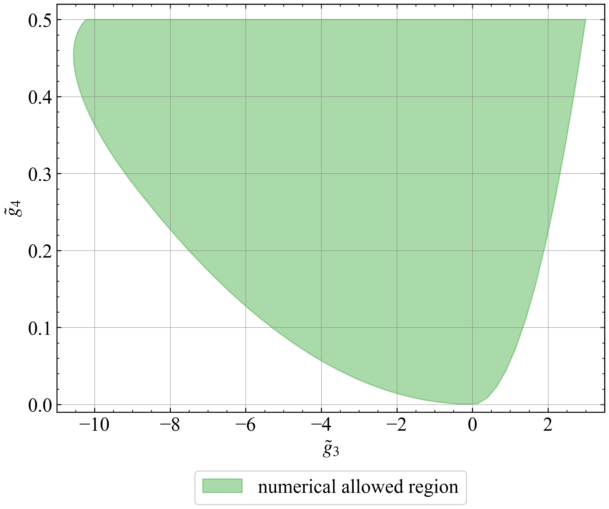

# PositivityBoundsByNeuralNetwork

## 問題設定
どういう式を, どういう拘束条件で解きたいのか

とりあえず細かい点には触れず要点のみ書いているので、詳しくは[ExtremalEFT論文](https://arxiv.org/abs/2011.02957)を参照ください。

### 問題
$d$ 次元時空中のmassless real scalar EFTの一般形を考えます。
$$
    \mathcal{L}_{\text{low}} =  -\frac{1}{2}(\partial_{\mu} \phi)^2  - \frac{g}{3!}\phi^3 - \frac{\lambda}{4!}\phi^4
            + \frac{g_2}{2}[(\partial_{\mu} \phi)^2]^2 + \frac{g_3}{3}(\partial_{\mu}\partial_{\nu} \phi)^2 (\partial_{\sigma}\phi)^2 + 4g_4[(\partial_{\mu}\partial_{\nu}\phi)^2]^2
            +...
$$
最終目標は、このようなEFTの高階微分項の結合定数 $g_2, g_3, ...$ に対して、高エネルギー領域においても理論がunitaryであるなどといった物理的仮定にもとづき、取りうる値の制限を決定することです (positivity boundsと呼ばれます)。

この理論のtreeレベル散乱振幅に対する分散関係式の議論から、高階結合定数 $g_k$ は、次のような $g_k$関数 $g_k(m^2,J)$ のheavy averageという操作によって与えられることが導けます。

$$
    g_2 = \Braket{g_2(m^2, J)}, \quad g_3 = \Braket{ g_3(m^2, J) }, \quad g_4 = \Braket{ g_4(m^2, J) }, \ \dots \label{sum rules}\tag{1}
$$
これらを分散的総和則と呼びます。
$g_k$関数の具体形は、

$$
    g_2(m^2, J) = \frac{1}{m^4}
$$

$$
    g_3(m^2, J) = \frac{3-\frac{4}{d-2}\mathcal{J}^2 }{m^6}
$$

$$
    g_4(m^2, J) =  \frac{ 1+ \frac{4-5d}{2d(d-2)}\mathcal{J}^2 + \frac{1}{d(d-2)}\mathcal{J}^4 }{ 2m^8 } 
$$

といった感じです。
$m^2$ はエネルギー、 $J$ はスピンをパラメトライズする変数です。
$ \mathcal{J}^2 := J(J+d-3) $ です (spin Casimir演算子の固有値)。

heavy average $\Big\langle f(m^2, J) \Big\rangle$ の定義は、
$$
    \Big\langle f(m^2, J) \Big\rangle := \sum_{J \ \text{even}} n_J^{(d)} \int_{M^2}^{\infty} \frac{dm^2}{\pi} m^{2-d}\rho_J(m^2) \  f(m^2, J)  
$$
です。 
$M^2$ はEFTのUV cutoffです。
$n_J^{(d)}$ は規格化定数です。
$ \rho_J(m^2) $ はスペクトル密度で, 高エネルギー領域でも理論がunitarityであるという要請から $ 0 \leq \rho_J(s) $ を満たします。
つまりheavy averageとは、cutoff以上の高エネルギー領域にわたるスペクトル密度で重みづけした積分、およびスピンにわたる総和をとる操作です。


また $g_4$ 以上については複数通りの分散的総和則が得られ、それらの両立条件から次のnull constraint $n_k(m^2,J)$ が要求されます。
$$
    0 = \Braket{ n_4(m^2,J) }, \quad n_4(m^2,J) := \frac{\mathcal{J}^2 \left(2\mathcal{J}^2 - (5d-4) \right) }{m^8}
    \label{null constraint}\tag{2}
$$

よって考えたい問題は、
null constraint $(\ref{null constraint})$ を満たすという拘束条件の下で、スペクトル密度 $ \rho_J(m^2) $ を任意に動かして、
その際に分散的総和則 $(\ref{sum rules})$ で得られる高階結合定数 $g_k$ の取り得る値の上限/下限を決定したい、ということになります。

先行研究の[ExtremalEFT論文](https://arxiv.org/abs/2011.02957)では、heavy averageが半正定値な汎関数であることを利用し、この問題を半正定値計画法により解いています。

$g_3, g_4$ についての結果は以下のような感じになります。




ただ、半正定値計画法による手法には以下のような不満点があります。

- 尖った部分については描画が難しく、適宜メッシュを細かくする必要がある
- next stepの研究として、low spin dominanceという仮定を追加したい。これはスペクトル密度 $ \rho_J(m^2) $に対する追加の拘束条件になるが、半正定値計画法ではスペクトル密度に対する条件を直接的に扱うことが難しい

そこで同じ問題をNNで解くことが出来ないかと考えています。
現行のコード lib/attempt4.py では、$g_2, g_3$ についてのpositivity boundsを計算するため、以下のようにNNを設計しています。

- 入力: $m^2, J$ の2変数。どちらも適当な値でメッシュに切り離散化
- 出力: スペクトル密度 $ \rho_J(m^2) $
- 損失関数: 
$$
    \mathrm{Loss} = a_2 \Braket{g_2(m^2, J)} + a_3 \Braket{g_3 (m^2, J)} + w_4 \left| \Braket{n_4(m^2, J)} \right|
$$

```
# loss function
def custom_loss(y_true, y_pred):
        a2 = 1 
        a3 = 1
        w4 = 1
        
        rho_vecotor = model(X_input)

        g2_term = a2 * heavy_average(func_vector=g2_vector, rho_vector=rho_vecotor)
        g3_term = a3 * heavy_average(func_vector=g3_vector, rho_vector=rho_vecotor)
        n4_term =  w4 * tf.abs(heavy_average(func_vector=n4_vector, rho_vector=rho_vecotor))
        loss =  g2_term + g3_term + n4_term
        # loss =  g2_term + g3_term
        return loss
```

この場合、係数$a_2, a_3, w_4$を手で適当に調整することにより、null constraint $\Braket{n_4(m^2, J)}=0$ が満たされた下で、$g_2$、$g_3$が最小化され下限が得られることを期待しています。
(上限を得たい時は損失関数中の対応する項を逆数にします。)
その上で$a_2$ と $a_3$ の比を動かしていくことで、上の図のような許容領域の絵が描ける、というのがやりたいことです。


## 現状
lib/attempt4.pyというファイルが現行のコード

損失関数がうまく収束せず、結果がうまく出力できていない状況

損失関数の中に拘束条件項があり、その重みづけのパラメータの値を色々変えてみるなど試したが、大抵の場合で損失関数の値が0かinfとなってしまう


## フォルダ構成
- lib/ : 本番ファイル
- practice/ : 練習、試行用

## 計画

1. [ExtremalEFT論文](https://arxiv.org/abs/2011.02957)の(g3,g4) plotをNNに描かせる: 
教師なし PINN
null constraintは損失関数に加えることで考慮

2. High Spin Supressionを考えてみる: 
spectral densityに対するconstraintを扱うことができるはず


## 期待されるメリット

SDPBとの比較

- メッシュの細かさを自動的に最適化してくれる

- constraintの扱いが簡単 損失関数に加えるだけ